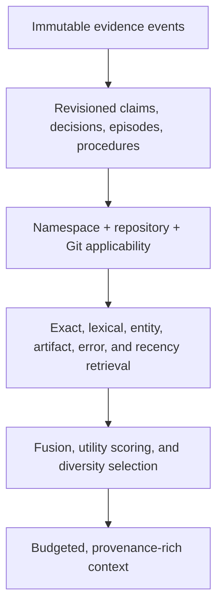

# super-mem

Evidence-first, Git-aware experience memory for coding agents.

`super-mem` is a local memory service for agents that work in repositories. It records observable evidence—prompts, tool outcomes, patches, tests, decisions, and corrections—and retrieves only the parts that fit the current task and repository state.

It is intended to work across Codex, Claude Code, OpenCode, Pi, and any client that can launch an MCP stdio server. The core and CLI are written in Rust; harness-specific adapters may be thin configuration or JavaScript/TypeScript wrappers where the host requires them.

> [!IMPORTANT]
> This repository is in early development. The storage schema and command surface may change before the first stable release. There are no unmeasured speed, quality, or benchmark claims here.

## Why this exists

Coding agents need more than a searchable transcript. Useful experience has state and evidence:

- A workaround may have failed, while a similar-looking command succeeded.
- An architecture decision may apply on `main` but not on a release branch.
- A note about a symbol may become stale after that symbol changes.
- A user correction should supersede an older claim without erasing its history.
- An exact compiler diagnostic can matter more than semantic similarity.

Poorly selected context can hurt coding-agent performance, while accurately selected prior experience can improve accuracy and reduce work. That is the central finding behind [SWE-ContextBench](https://arxiv.org/abs/2602.08316). `super-mem` therefore treats selection, applicability, and provenance as part of memory—not as cleanup after retrieval.

## Design principles

### Evidence before summaries

Derived facts and procedures point back to observable source events. A summary is an index, not the ground truth.

### Git state is part of truth

Memories can be scoped to a repository, commit, branch, worktree patch, path, or symbol. Results can be classified as exact, compatible, stale, divergent, or unversioned relative to the current checkout. A different namespace or repository is inapplicable and excluded before ranking.

### Success and failure are different memories

Commands, exit status, diagnostics, changed files, and validation results remain attached to an episode. A failed attempt is useful as a warning, but it must not be returned as a recommended procedure.

### Corrections do not destroy history

New evidence may supersede, contest, or retract a claim. Historical evidence remains inspectable unless the user explicitly purges the local store.

### Context has a budget

Recall is assembled under an explicit token or byte budget. The goal is a small evidence bundle containing current facts, useful procedures, known failures, conflicts, and source references.

### Required rules stay in the repository

Memory is a recall layer, not a policy mechanism. Put requirements that must always apply in `AGENTS.md`, `CLAUDE.md`, checked-in documentation, or deterministic hooks. This matches [Codex's own guidance](https://learn.chatgpt.com/docs/customization/memories?surface=app) to keep required team instructions outside generated memory.

## Model



The append-only event history is the source of truth. Search indexes and active views are derived and can be rebuilt.

## Quickstart

The examples below use the current `supermem` command surface. Until release artifacts are published, build the workspace locally.

```sh
cargo build --release
./target/release/supermem --help
```

The workspace currently requires Rust 1.88. Put `target/release` on `PATH` for the commands below, or replace `supermem` with `./target/release/supermem`.

Initialize a local store:

```sh
supermem init
```

Record an explicit observation or decision for the repository discovered from the working directory:

```sh
supermem remember \
  --kind decision \
  --body "Use the workspace-level Cargo profile; package profiles are ignored" \
  --cwd .
```

Compile a bounded evidence packet for a task:

```sh
supermem recall \
  --query "why is the release profile not taking effect?" \
  --cwd . \
  --token-budget 1200
```

Run the MCP server over stdio:

```sh
supermem mcp --root /absolute/path/to/repo --namespace default
```

An MCP client configuration has this general shape:

```json
{
  "mcpServers": {
    "super-mem": {
      "command": "supermem",
      "args": ["mcp", "--root", "/absolute/path/to/repo", "--namespace", "default"]
    }
  }
}
```

See [Harness integrations](docs/integrations.md) for host-specific configuration and the distinction between MCP access and automatic hook capture.

Create a full, integrity-checked snapshot with
`supermem export --output memory.jsonl`. Restore with
`supermem import memory.jsonl`; snapshot restore is atomic and intentionally
requires an otherwise empty Super Mem database rather than attempting
ambiguous record merges. Export streams directly to stdout or a private file;
the current import API still buffers the complete snapshot in memory.

Keep the database outside the repository when possible. Before a
scope-sensitive command (`remember`, `observe`, `checkpoint`, or `recall`), a
hook, or MCP opens SQLite, Unix builds accept a database inside the worktree
only when all four possible paths (the main file plus `-wal`, `-shm`, and
`-journal`) are untracked, Git-ignored, and free of symbolic links or multiple
hard links. These paths also reject `..`; pass a canonical path instead. V0.1
requires repository-local databases to be moved outside the worktree on
non-Unix platforms because safe hard-link verification is unavailable.
The non-scoped `init`, `inspect`, `feedback`, `retract`, `status`, `doctor`,
`export`, `import`, and `purge` commands intentionally do not apply this
Git-applicability guard.

## MCP surface

The model-facing surface is deliberately small so tool schemas do not consume unnecessary context:

| Tool | Purpose |
| --- | --- |
| `memory_context` | Build a scoped, budgeted evidence packet for the current task. |
| `memory_feedback` | Attach an observed result or user judgment to prior memory. |
| `memory_manage` | Inspect or retract a memory. Status and physical purge are restricted to the human-facing CLI. |
| `memory_record` | Record a typed memory, task checkpoint, or source observation. |

Automatic capture should use deterministic harness hooks rather than relying on the model to remember to call a tool.
Namespace, workspace, root, and repository identity are pinned by the trusted
MCP launch command and never accepted from model tool arguments. The server
rediscovers current Git state from the pinned root on every call.

## Lossless performance design

SQLite remains the canonical event and revision store. Recall batches the
canonical rows and their evidence instead of issuing per-memory queries. Its
contentless FTS5 table is a rebuildable projection, and static hot-path SQL
uses a bounded prepared-statement cache. Eligibility is applied before channel
limits, and every tied collector, scorer, and diversity-selection step has an
explicit deterministic order.
These optimizations do not lower candidate limits, omit evidence, weaken
durability, or approximate similarity. Snapshot tests compare canonical rows,
floating-point bit patterns, and integrity footers across export and restore.

The OpenCode and Pi adapters preserve the existing UTF-8-safe lifecycle cap
while scanning oversized messages without materializing an array of every
Unicode code point. The cap and its truncation marker are data-minimization
policy, not a performance shortcut introduced by this optimization.

## How it differs from generic vector memory

This is a difference in data model, not a claim that one approach wins every workload.

| Concern | Generic chunk/vector memory | `super-mem` design |
| --- | --- | --- |
| Stored unit | Text chunk or summary | Evidence event plus derived claim, decision, episode, or procedure |
| Retrieval | Primarily semantic similarity | Scope and Git applicability first; exact and lexical retrieval; optional semantic retrieval later |
| Updates | New chunk, overwrite, or delete | Explicit supersession, contest, retraction, and historical view |
| Repository state | Usually metadata or a filter | Commit DAG, branch, dirty patch, path, and symbol applicability |
| Failed work | Often indistinguishable from useful text | Outcome-labeled failed attempt or known failure |
| Provenance | Document/chunk reference | Event, tool result, patch, diagnostic, and Git source reference |
| Context output | Ranked snippets | Budgeted sections for current facts, procedures, failures, conflicts, and evidence |

Vector search remains useful for paraphrases. It is not sufficient by itself for exact diagnostics, branch validity, contradictions, or outcome-aware experience.

## Privacy and safety

The intended default is local storage with no telemetry and no remote model requirement. Local-first does not automatically make captured data safe: tool output can contain credentials, private source, or malicious instructions.

The design therefore requires:

- Secret and sensitive-path filtering before durable storage.
- Repository and identity scoping before retrieval, not after ranking.
- Memory content treated as untrusted evidence, never as executable instruction.
- User-visible provenance and controls for inspection, export, retraction, and supported-platform full-store purge. V0.1 conservatively refuses purge on Windows because stable Rust cannot verify hard-link counts.
- No collection of hidden model reasoning.

Read the full [privacy and threat model](docs/privacy-and-threat-model.md) before enabling automatic capture.

## Evaluation

Quality is evaluated at fixed context budgets, with separate measurements for retrieval, stale-memory handling, supersession, evidence coverage, and downstream task outcomes. Latency and memory use are reported separately from quality.

The repository includes a small labeled [evaluation fixture](fixtures/eval/v1.jsonl) covering:

- Supersession.
- Failed attempts.
- Repository isolation.
- Branch divergence.
- Stale artifacts.
- Exact error recall.

See [Evaluation methodology](docs/evaluation.md) and [benchmark notes](benches/README.md). Published results must include the commit, corpus, hardware, model, prompt, budget, and comparison configuration needed to reproduce them.

## Documentation

- [Architecture](docs/architecture.md)
- [Harness integrations](docs/integrations.md)
- [Privacy and threat model](docs/privacy-and-threat-model.md)
- [Evaluation methodology](docs/evaluation.md)
- [Fixture format](fixtures/eval/README.md)

## Non-goals for the first release

- Replacing repository instructions or policy enforcement.
- Storing hidden chain-of-thought.
- Claiming causal relationships from event order alone.
- Automatically sharing memory between unrelated repositories or users.
- Becoming a document-ingestion platform or general personal knowledge base.
- Supporting every programming language with deep semantic indexing on day one.

## License

MIT
